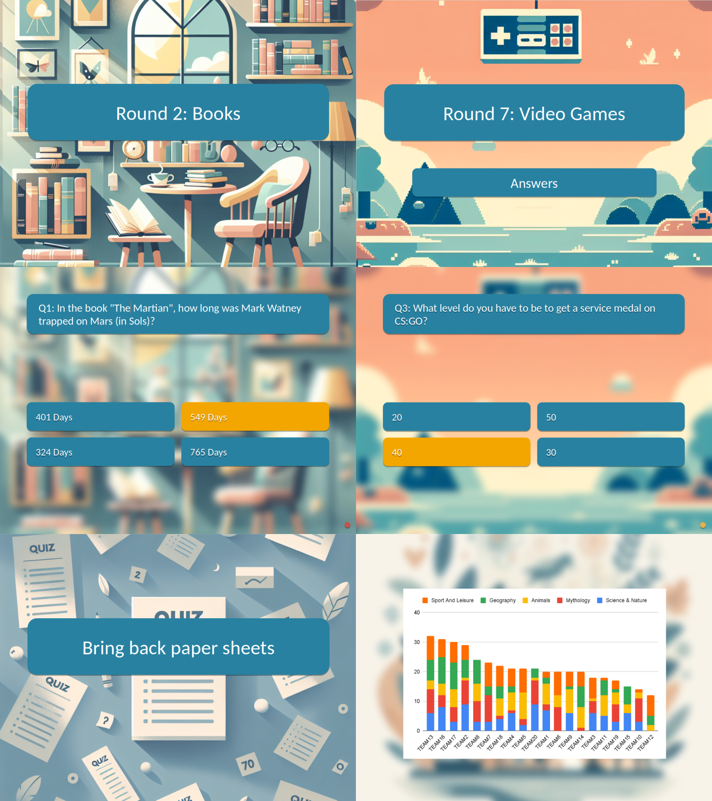
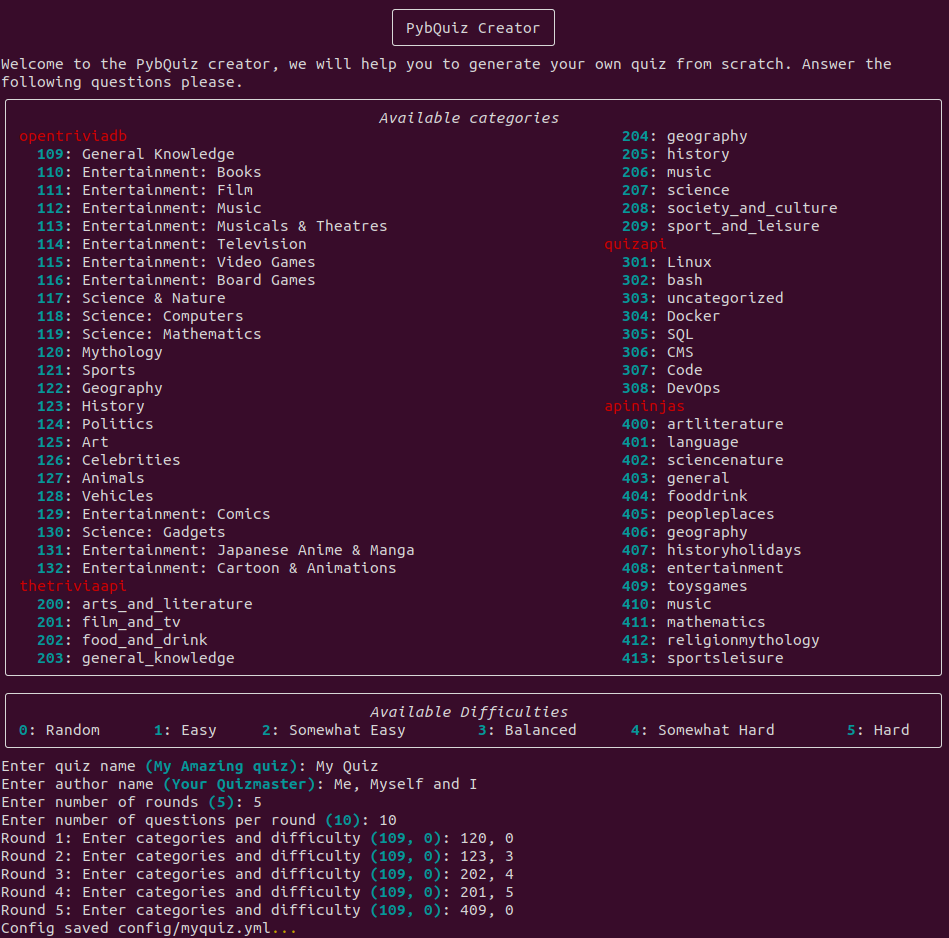

# PybQuiz

PybQuiz is a Python package designed to help you create and manage pub quizzes effortlessly. Whether you're hosting a small quiz night at a local pub or a large trivia event, PybQuiz has the tools you need to make your quiz a success. An example generated using the is available under the official [RELEASE](https://github.com/christianabbet/pybQuiz/releases) folder. The repo is abel to generate a pptx file as well as export your quiz directely to Google slides and sheets to manage the teams scores during the quiz.




## Setup

Clone repo and create environement

```bash
# Clone repo
git clone https://github.com/christianabbet/pybQuiz.git
cd pybQuiz

# Using conda
conda create -n pybquiz python=3.9
conda activate pybquiz
# Base packages
pip install numpy pyyaml tqdm py-markdown-table pandas python-pptx rich
# To export to Google Slides / Sheets
pip install --upgrade google-api-python-client google-auth-httplib2 google-auth-oauthlib
# To generate new backgorunds
pip install --upgrade openai
```

Create your quiz

```bash
# Run quiz creating 
python run_create_quiz.py

# To get additonal parameters infromation
python run_create_quiz.py -h
```

```bash
options:
  -h, --help            show this help message and exit
  --cfg CFG             path to config file (default if None)
  --dirout DIROUT       path to output directory for data generation (default is "output")
  --apitoken APITOKEN   path to stored API tokens (default is "config/apitoken.yml")
  --googlecreds GOOGLECREDS
                        path to stored Google credentials (default is "config/credentials.json")
```

Note that some APIs need a token to be accessed. Please refer to the API section to know how to setup tokens. 




## Available APIs

### 1. Open Trivia DB

* **Tag**: opentriviadb
* **Link**: https://opentdb.com/
* **API-Token**: Not required

|ID|               Category               |Easy|Medium|Hard|Text|Image|
|--|-------------------------------------|----|------|----|----|-----|
| 9|          General Knowledge          | 128|  124 | 61 | 313|  0  |
|10|         Entertainment: Books        | 31 |  41  | 27 | 99 |  0  |
|11|         Entertainment: Film         | 88 |  119 | 43 | 250|  0  |
|12|         Entertainment: Music        | 110|  189 | 68 | 367|  0  |
|13|  Entertainment: Musicals & Theatres |  9 |  13  | 10 | 32 |  0  |
|14|      Entertainment: Television      | 69 |  72  | 29 | 170|  0  |
|15|      Entertainment: Video Games     | 330|  448 | 195| 973|  0  |
|16|      Entertainment: Board Games     | 19 |  15  | 25 | 59 |  0  |
|17|           Science & Nature          | 61 |  100 | 69 | 230|  0  |
|18|          Science: Computers         | 48 |  74  | 37 | 159|  0  |
|19|         Science: Mathematics        | 14 |  24  | 17 | 55 |  0  |
|20|              Mythology              | 19 |  26  | 13 | 58 |  0  |
|21|                Sports               | 48 |  65  | 20 | 133|  0  |
|22|              Geography              | 80 |  139 | 56 | 275|  0  |
|23|               History               | 68 |  166 | 80 | 314|  0  |
|24|               Politics              | 18 |  26  | 15 | 59 |  0  |
|25|                 Art                 | 13 |  11  |  9 | 33 |  0  |
|26|             Celebrities             | 13 |  31  |  8 | 52 |  0  |
|27|               Animals               | 28 |  30  | 18 | 76 |  0  |
|28|               Vehicles              | 21 |  32  | 18 | 71 |  0  |
|29|        Entertainment: Comics        | 15 |  34  | 19 | 68 |  0  |
|30|           Science: Gadgets          | 14 |  10  |  5 | 29 |  0  |
|31|Entertainment: Japanese Anime & Manga| 59 |  80  | 45 | 184|  0  |
|32| Entertainment: Cartoon & Animations | 31 |  41  | 17 | 89 |  0  |


### 2. The Trivia API

* **Tag**: thetriviaapi
* **Link**: https://the-trivia-api.com/
* **API-Token**: Not required


|ID|      Category      |Easy|Medium|Hard|Text|Image*|
|--|-------------------|----|------|----|----|-----|
| 0|arts_and_literature| 84 |  375 | 708|1160|  7  |
| 1|    film_and_tv    | 157|  709 | 892|1466| 292 |
| 2|   food_and_drink  | 86 |  392 | 327| 759|  46 |
| 3| general_knowledge | 51 |  200 | 240| 393|  98 |
| 4|     geography     | 256|  764 |1019|1626| 413 |
| 5|      history      | 55 |  475 | 499| 964|  65 |
| 6|       music       | 171|  495 | 741|1217| 190 |
| 7|      science      | 118|  601 | 555|1271|  3  |
| 8|society_and_culture| 155|  604 | 495|1242|  12 |
| 9| sport_and_leisure | 52 |  216 | 309| 557|  20 |

${}^{*}$ Only available for premium users (not free). Not supported.

### 3. QuizAPI

* **Tag**: quizapi
* **Link**: https://quizapi.io/
* **API-Token**: Required

|ID|   Category   |Easy*|Medium*|Hard*|Text*|Image|
|--|-------------|----|------|----|----|-----|
| 1|    Linux    | -1 |  -1  | -1 | -1 |  0  |
| 2|     bash    | -1 |  -1  | -1 | -1 |  0  |
| 3|uncategorized| -1 |  -1  | -1 | -1 |  0  |
| 4|    Docker   | -1 |  -1  | -1 | -1 |  0  |
| 5|     SQL     | -1 |  -1  | -1 | -1 |  0  |
| 6|     CMS     | -1 |  -1  | -1 | -1 |  0  |
| 7|     Code    | -1 |  -1  | -1 | -1 |  0  |
| 8|    DevOps   | -1 |  -1  | -1 | -1 |  0  |

${}^{*}$ Distribution of question categories and difficulties unknown.

### 4. API Ninjas - Trivia

* **Tag**: apininjas
* **Link**: https://api-ninjas.com/api/trivia
* **API-Token**: Required


|ID|     Category     |Easy**|Medium**|Hard**|Text*|Image|
|--|-----------------|----|------|----|----|-----|
| 0|  artliterature  | -1 |  -1  | -1 | -1 |  0  |
| 1|     language    | -1 |  -1  | -1 | -1 |  0  |
| 2|  sciencenature  | -1 |  -1  | -1 | -1 |  0  |
| 3|     general     | -1 |  -1  | -1 | -1 |  0  |
| 4|    fooddrink    | -1 |  -1  | -1 | -1 |  0  |
| 5|   peopleplaces  | -1 |  -1  | -1 | -1 |  0  |
| 6|    geography    | -1 |  -1  | -1 | -1 |  0  |
| 7| historyholidays | -1 |  -1  | -1 | -1 |  0  |
| 8|  entertainment  | -1 |  -1  | -1 | -1 |  0  |
| 9|    toysgames    | -1 |  -1  | -1 | -1 |  0  |
|10|      music      | -1 |  -1  | -1 | -1 |  0  |
|11|   mathematics   | -1 |  -1  | -1 | -1 |  0  |
|12|religionmythology| -1 |  -1  | -1 | -1 |  0  |
|13|  sportsleisure  | -1 |  -1  | -1 | -1 |  0  |

${}^{*}$ Distribution of question categories and difficulties unknown.
${}^{**}$ No difficulty level


## API Tokens and Google support

To access certain content, you **need** an API Token. Once obtained, create a file `apitoken.yml` under the `config` folder. For each library ([OpenTriviaDB](https://opentdb.com/api_config.php), [TheTriviaAPI](https://the-trivia-api.com/license/), [QuizAPI](https://quizapi.io/clientarea/settings/token) [APINinjas](https://api-ninjas.com/profile)), you can generate you token by folowing the instructions linked. 

The Google Slide API is not mandatory if only the pptx are wanted. To setup the Google slides API and to generate your credential file `credentials.json`, please take a look at the [doc](https://developers.google.com/slides/api/quickstart/python).


```bash
# Folder structure
└── pybQuiz
    └── config
        ├── credentials.json
        └── apitoken.yml
```

Fill the `apitoken.yml` file with your own API keys. 

```yml
---
# Optional API tokens
OpenTriviaDB: YOUR_API_KEY_1
TheTriviaAPI: YOUR_API_KEY_2
QuizAPI: YOUR_API_KEY_3
APINinjas: YOUR_API_KEY_4
...
```

## Coming Next

* [ ] Check if multiple time same question 
    [ ] At the quiz level
    [ ] Between multiple quizes
* [ ] Google slide export
  * [ ] Check text auto adapt to size ?
  

## Thanks


```bash
# Quiz Style (inspiration)
https://github.com/devinardya/Quiz-Game?tab=readme-ov-file

# Trivia APIs
https://opentdb.com
https://the-trivia-api.com
https://quizapi.io
https://api-ninjas.com/profile

```