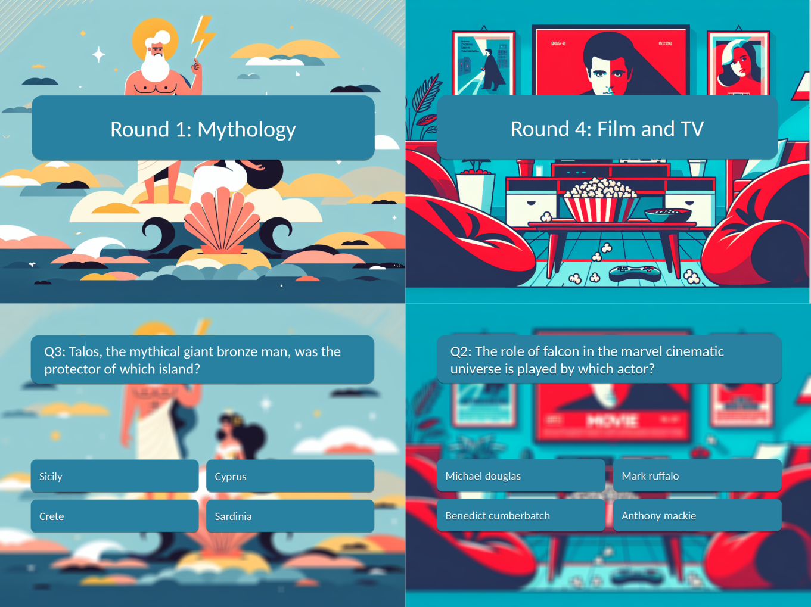

# PybQuiz

PybQuiz is a Python package designed to help you create and manage pub quizzes effortlessly. Whether you're hosting a small quiz night at a local pub or a large trivia event, PybQuiz has the tools you need to make your quiz a success.



```bash
# Using conda
conda create env -n pybquiz
conda activate pybquiz
pip install numpy tqdm py-markdown-table
# If OpenAI support wanted 
pip install --upgrade openai
```

Create your quiz

```bash
# Run quiz creating based on given config file
python run_create_quiz.py

# Extra available arguments
--name YOURNAME                 # Name of the output file
--dirout /path/to/dir           # Output directory
--cfg /path/to/template.yml     # Link to config file (custom quiz)
--token /path/to/apitoken.yml   # Link to APIs token file
```

# Available APIs

## 1. Open Trivia DB

* **Tag**: opentriviadb
* **Link**: https://opentdb.com/
* **API-Token**: Not required

|ID|               Category               |Easy|Medium|Hard|Text|Image|
|--|-------------------------------------|----|------|----|----|-----|
| 9|          General Knowledge          | 128|  124 | 61 | 313|  0  |
|10|         Entertainment: Books        | 31 |  41  | 27 | 99 |  0  |
|11|         Entertainment: Film         | 88 |  119 | 43 | 250|  0  |
|12|         Entertainment: Music        | 110|  189 | 68 | 367|  0  |
|13|  Entertainment: Musicals & Theatres |  9 |  13  | 10 | 32 |  0  |
|14|      Entertainment: Television      | 69 |  72  | 29 | 170|  0  |
|15|      Entertainment: Video Games     | 330|  448 | 195| 973|  0  |
|16|      Entertainment: Board Games     | 19 |  15  | 25 | 59 |  0  |
|17|           Science & Nature          | 61 |  100 | 69 | 230|  0  |
|18|          Science: Computers         | 48 |  74  | 37 | 159|  0  |
|19|         Science: Mathematics        | 14 |  24  | 17 | 55 |  0  |
|20|              Mythology              | 19 |  26  | 13 | 58 |  0  |
|21|                Sports               | 48 |  65  | 20 | 133|  0  |
|22|              Geography              | 80 |  139 | 56 | 275|  0  |
|23|               History               | 68 |  166 | 80 | 314|  0  |
|24|               Politics              | 18 |  26  | 15 | 59 |  0  |
|25|                 Art                 | 13 |  11  |  9 | 33 |  0  |
|26|             Celebrities             | 13 |  31  |  8 | 52 |  0  |
|27|               Animals               | 28 |  30  | 18 | 76 |  0  |
|28|               Vehicles              | 21 |  32  | 18 | 71 |  0  |
|29|        Entertainment: Comics        | 15 |  34  | 19 | 68 |  0  |
|30|           Science: Gadgets          | 14 |  10  |  5 | 29 |  0  |
|31|Entertainment: Japanese Anime & Manga| 59 |  80  | 45 | 184|  0  |
|32| Entertainment: Cartoon & Animations | 31 |  41  | 17 | 89 |  0  |


## 2. The Trivia API

* **Tag**: thetriviaapi
* **Link**: https://the-trivia-api.com/
* **API-Token**: Not required


|ID|      Category      |Easy|Medium|Hard|Text|Image*|
|--|-------------------|----|------|----|----|-----|
| 0|arts_and_literature| 84 |  375 | 708|1160|  7  |
| 1|    film_and_tv    | 157|  709 | 892|1466| 292 |
| 2|   food_and_drink  | 86 |  392 | 327| 759|  46 |
| 3| general_knowledge | 51 |  200 | 240| 393|  98 |
| 4|     geography     | 256|  764 |1019|1626| 413 |
| 5|      history      | 55 |  475 | 499| 964|  65 |
| 6|       music       | 171|  495 | 741|1217| 190 |
| 7|      science      | 118|  601 | 555|1271|  3  |
| 8|society_and_culture| 155|  604 | 495|1242|  12 |
| 9| sport_and_leisure | 52 |  216 | 309| 557|  20 |

${}^{*}$ Only available for premium users (not free). Not supported.

## 3. QuizAPI

* **Tag**: quizapi
* **Link**: https://quizapi.io/
* **API-Token**: Required

|ID|   Category   |Easy*|Medium*|Hard*|Text*|Image|
|--|-------------|----|------|----|----|-----|
| 1|    Linux    | -1 |  -1  | -1 | -1 |  0  |
| 2|     bash    | -1 |  -1  | -1 | -1 |  0  |
| 3|uncategorized| -1 |  -1  | -1 | -1 |  0  |
| 4|    Docker   | -1 |  -1  | -1 | -1 |  0  |
| 5|     SQL     | -1 |  -1  | -1 | -1 |  0  |
| 6|     CMS     | -1 |  -1  | -1 | -1 |  0  |
| 7|     Code    | -1 |  -1  | -1 | -1 |  0  |
| 8|    DevOps   | -1 |  -1  | -1 | -1 |  0  |

${}^{*}$ Distribution of question categories and difficulties unknown.

## 4. API Ninjas - Trivia

* **Tag**: apininjas
* **Link**: https://api-ninjas.com/api/trivia
* **API-Token**: Required


|ID|     Category     |Easy**|Medium**|Hard**|Text*|Image|
|--|-----------------|----|------|----|----|-----|
| 0|  artliterature  | -1 |  -1  | -1 | -1 |  0  |
| 1|     language    | -1 |  -1  | -1 | -1 |  0  |
| 2|  sciencenature  | -1 |  -1  | -1 | -1 |  0  |
| 3|     general     | -1 |  -1  | -1 | -1 |  0  |
| 4|    fooddrink    | -1 |  -1  | -1 | -1 |  0  |
| 5|   peopleplaces  | -1 |  -1  | -1 | -1 |  0  |
| 6|    geography    | -1 |  -1  | -1 | -1 |  0  |
| 7| historyholidays | -1 |  -1  | -1 | -1 |  0  |
| 8|  entertainment  | -1 |  -1  | -1 | -1 |  0  |
| 9|    toysgames    | -1 |  -1  | -1 | -1 |  0  |
|10|      music      | -1 |  -1  | -1 | -1 |  0  |
|11|   mathematics   | -1 |  -1  | -1 | -1 |  0  |
|12|religionmythology| -1 |  -1  | -1 | -1 |  0  |
|13|  sportsleisure  | -1 |  -1  | -1 | -1 |  0  |

${}^{*}$ Distribution of question categories and difficulties unknown.
${}^{**}$ No difficulty level


# Add Token

To access certain content, you need an API Token. Once obtained, create a file `apitoken.yml` under the `config` folder. Fill the file with your own API keys. 

```yml
---

# Optional API tokens
opentriviadb: YOUR_API_KEY_1
thetriviaapi: YOUR_API_KEY_2
quizapi: YOUR_API_KEY_3
apininjas: YOUR_API_KEY_4
...
```

For each library ([opentriviadb](https://opentdb.com/api_config.php), [thetriviaapi](https://the-trivia-api.com/license/), [quizapi](https://quizapi.io/clientarea/settings/token)) [apininjas](https://api-ninjas.com/profile), you can generate you token by folowing the instructions linked.

# Custom config files

You can create your own config file Here is an examples on how to create a new quiz. Create a new file `myquiz.yml`. Look above to know the suported libraries


```
touch config/myquiz.yml
```

Then structure the yaml file as described below
```yml
---

BaseInfo:                       # Base information for the API
  title: "Amazing Pyb Quiz"     # Quiz title
  delay_api: 5                  # Delay to use in seconds between API queries
  verbose: True                 # Extended verbose terminal output
  clear_cache: False            # If True, update stats about remote DB (slow)

Rounds:                         # List of rounds
-
  title: "Video Games"          # Title of the round
  api: "opentriviadb"           # Name of the library. See tags above
  theme_id: 12                  # ID of the theme, see lookup table
  difficulty: [5, 3, 2]         # Difficulty level question [easy, medium, hard]
  shuffle: True                 # If True, random difficult order
-
  title: "Science"              # Title of the round
  api: "thetriviaapi"           # Name of the library. See tags above
  theme_id: 7                   # ID of the theme, see lookup table
  difficulty: [2, 2, 6]         # Difficulty level question [easy, medium, hard]
  shuffle: True                 # If True, random difficult order
  
...
```

Then run the creation of the quiz
```
python run_create_quiz.py --cfg config/myquiz.yml
```

# Coming Next

* [ ] Google slide export
* [ ] Add PPT / PDF generation
  * [ ] Check if multiple time same question [apininjas]
  * [ ] Add difficulty information on slides
  * [ ] Remove need for typing font path (linux ?)
  * [ ] Remove shadow in images
  * [ ] Modify title slides with background image
  * [ ] Add color customization for text and boxes
  * [ ] Add blur option
* [ ] Add openai generation for templates
  * [ ] Add prompt in template


Thanks
------

"""
https://github.com/devinardya/Quiz-Game?tab=readme-ov-file
"""